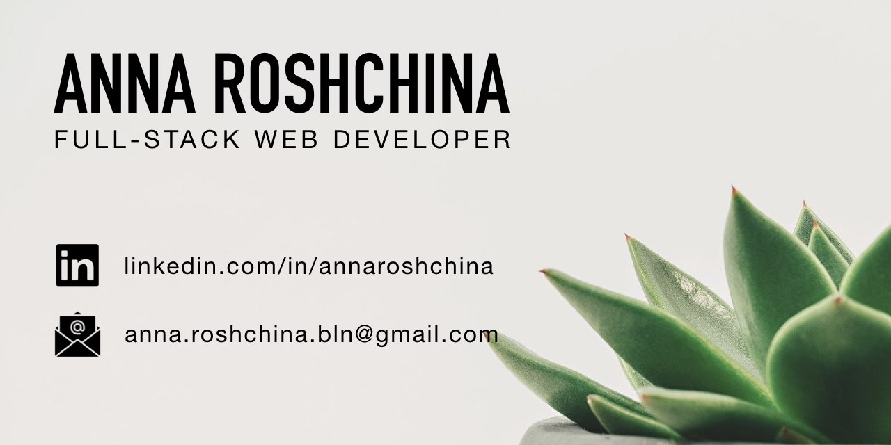

# Hi! I am Anna.   Welcome to my Code 👩🏼‍💻

### About me

I am a full-stack web developer based in Berlin. I came into coding from a rich and diverse academic and teaching background. Constant learning and challenging my mind define my professional life as well as my personality. That is why I decided to become a web developer and work in a dynamic environment which encourages a life-time learning.

### Currently open to work 🔭

I am looking for a nice dev team to join as a frontend or full-stack developer. As I am writing my M.A. thesis this semester, so I am also open to a part-time, a working student's role or an internships 📚

### Contact me

### Tech Stack

<!--
**anna-rosh/anna-rosh** is a ✨ _special_ ✨ repository because its `README.md` (this file) appears on your GitHub profile.

Here are some ideas to get you started:

- 🔭 I’m currently working on ...
- 🌱 I’m currently learning ...
- 👯 I’m looking to collaborate on ...
- 🤔 I’m looking for help with ...
- 💬 Ask me about ...
- 📫 How to reach me: ...
- 😄 Pronouns: ...
- ⚡ Fun fact: ...
-->
